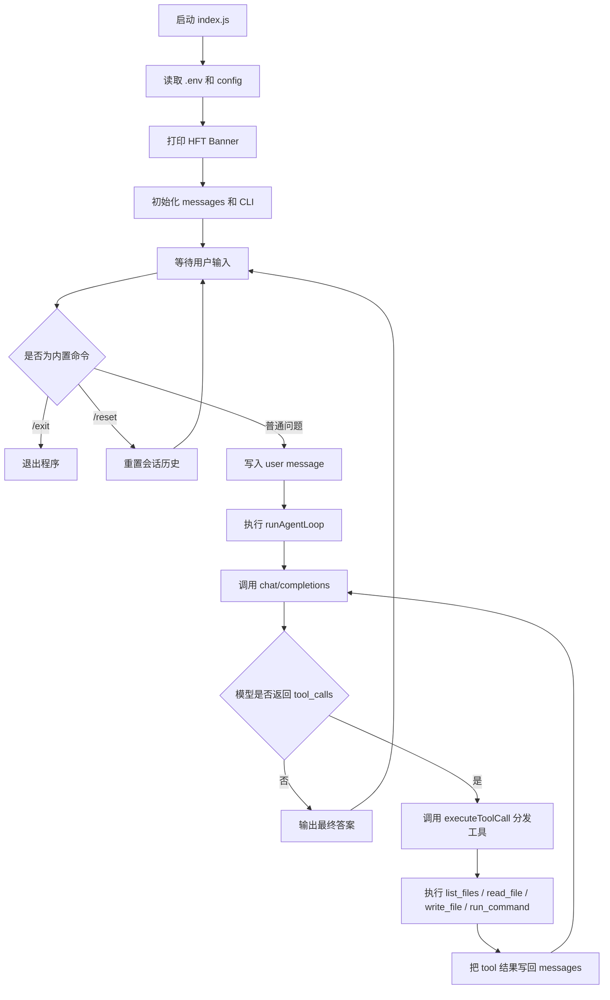

# Agent 执行流程图

下面这张图对应当前本地 Node.js 智能体的真实执行路径。

## 模块职责

- `src/index.js`：命令行入口，接收输入并驱动主循环
- `src/config.js`：读取环境变量和运行配置
- `src/banner.js`：打印启动 Logo 和基础信息
- `src/client.js`：请求模型接口
- `src/agent.js`：实现模型与工具之间的闭环调度
- `src/tools.js`：声明并执行本地工具
- `src/utils.js`：放通用工具函数