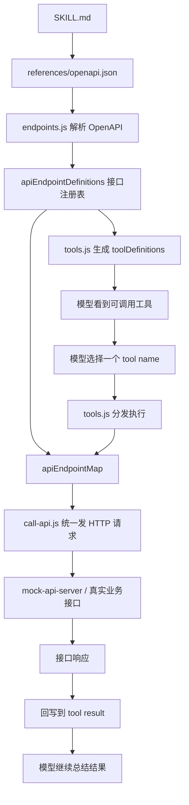

# OpenAPI 到 Tools 的流程图

这份文档专门解释当前项目里这条链路：

`skills/.../references/openapi.json -> endpoints.js -> tools.js -> call-api.js`

## 1. 整体流程图



## 2. 每个文件的职责

- `skills/.../SKILL.md`
  负责业务规则，例如什么时候调用哪个接口、缺少参数时不能猜、失败时怎么说明。

- `skills/.../references/openapi.json`
  负责接口定义，是接口结构的来源，包括方法、路径、参数、请求体和返回说明。

- `src/api/endpoints.js`
  负责把 OpenAPI 转成当前 agent 可直接使用的“接口注册表”。

- `src/tools.js`
  负责两件事：
  1. 把接口注册表变成 toolDefinitions
  2. 在模型调用某个 tool 时，找到对应接口定义并分发执行

- `src/api/call-api.js`
  负责真正执行 HTTP 请求，包括拼路径、拼 query、拼 body、发 fetch 和标准化返回。

## 3. 最关键的一层：endpoints.js

`endpoints.js` 的作用可以概括成一句话：

> 它不是发请求，而是把接口文档翻译成 agent 能直接用的接口定义结构。

例如 OpenAPI 里的这段：

```json
"/api/users/{userId}/role": {
  "patch": {
    "operationId": "update_user_role"
  }
}
```

会被转换成更适合 tools 使用的结构：

```js
{
  name: "update_user_role",
  method: "PATCH",
  path: "/api/users/{userId}/role",
  pathFields: ["userId"],
  bodyFields: ["role"],
  parameters: { ... }
}
```

## 4. 为什么不直接让 tools.js 读 openapi.json

可以这样做，但职责会混在一起。

拆出 `endpoints.js` 的好处是：

- 接口解析和工具分发分层
- 后面更容易调试
- 接口来源更清晰
- 同一份接口注册表还可以继续用于生成文档

## 5. 一句话总结

> `openapi.json` 负责描述接口，`endpoints.js` 负责把描述翻译成注册表，`tools.js` 负责把注册表暴露给模型，`call-api.js` 负责真正把请求发出去。
